Autonomous Venture Studio Powered by Multi-Agent AI

Transform startup ideas into investor-ready businesses through intelligent venture planning, market research, financial modeling, branding, technical architecture, and pitch generation.

[](https://github.com/your-org/StartupForge-AI)
[](LICENSE)
[]
[]
[]
[]
[]

---

## Product Walkthrough

StartupForge AI transforms startup ideas into investor-ready business plans using a multi-agent AI workflow.

The demonstration below showcases the complete user journey:

1. Create Startup
2. Validate Idea
3. Generate Market Research
4. Analyze Competitors
5. Build Financial Model
6. Generate Technical Architecture
7. Produce Investor Reports
8. Export Deliverables

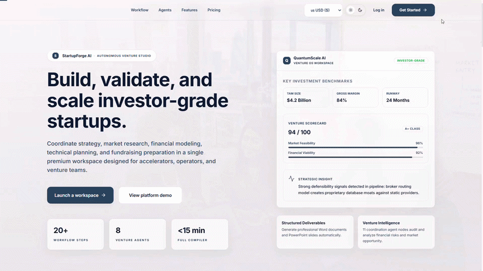

### Workflow Demonstrated

- Authentication
- Startup Creation
- Agent Execution
- Research Generation
- Report Generation
- Export Functionality

---

## Screenshots

### Landing Page Overview
The Landing Page introduces StartupForge AI as a polished, investor-grade platform and drives founders directly into the startup creation workflow.

#### Key Capabilities
- Hero messaging for startup founders
- One-click startup idea submission
- Platform feature overview
- Value proposition for investor-ready businesses

#### Technical Highlights
- Next.js static rendering
- SEO-friendly landing content
- Responsive TailwindCSS layout
- CTA integration with backend startup APIs

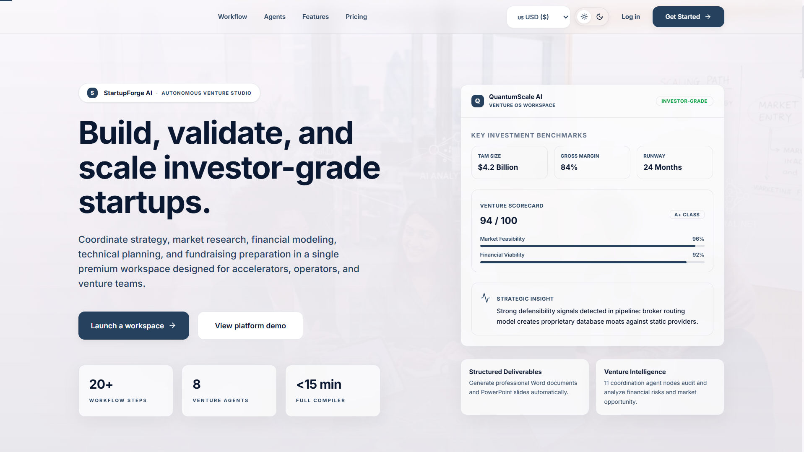

---

### Dashboard Overview
The Dashboard serves as the central command center for StartupForge AI, providing founders with visibility into startup validation progress, generated reports, workflow executions, and business planning activities.

#### Key Capabilities
- Startup portfolio management
- Workflow execution tracking
- AI-generated report access
- Startup performance metrics
- Venture planning overview

#### Technical Highlights
- React + Next.js frontend
- FastAPI backend integration
- Real-time API-driven metrics
- JWT-authenticated user workspace

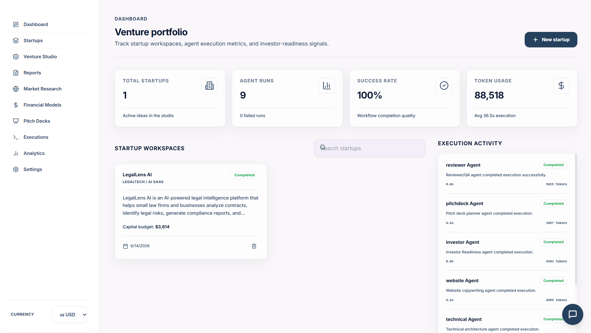

---

### Startup Workspace Overview
The Startup Workspace is where founders capture concept details, configure assumptions, and start the AI-driven validation and ideation process.

#### Key Capabilities
- Structured startup input form
- Idea validation controls
- Currency and market settings
- Startup milestone checklist

#### Technical Highlights
- Form state management with React hooks
- Secure REST API submission
- Validation and feedback pipeline
- Persistent startup draft support

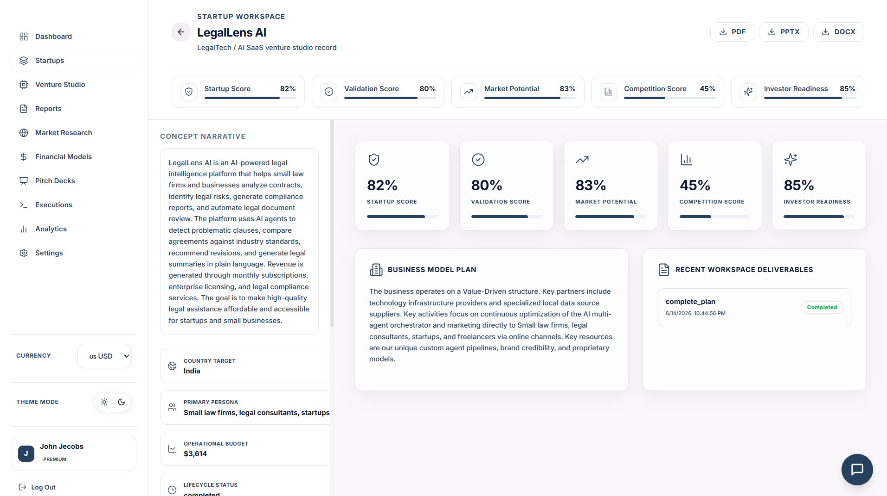

---

### Venture Studio Overview
The Venture Studio visualizes the agent orchestration process and gives founders a single place to manage startup execution tasks and review detailed section outputs.

#### Key Capabilities
- Agent workflow overview
- Section-by-section venture progress
- Collaborative output review
- Document export controls

#### Technical Highlights
- Dynamic UI state from FastAPI workflows
- Agent execution status polling
- Modular card-based studio layout
- Graph-style workflow visualization

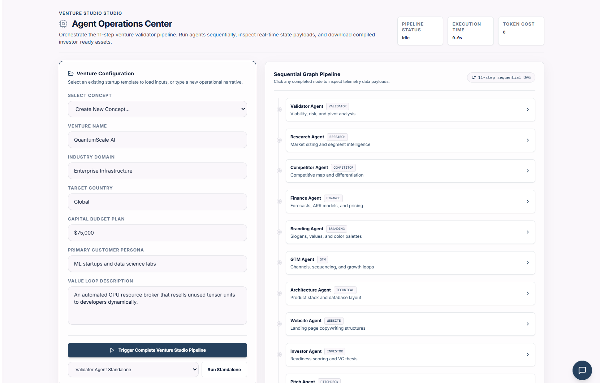

---

### Market Research Overview
The Market Research screen demonstrates how StartupForge AI generates actionable TAM/SAM/SOM estimates, trend analysis, segmentation, and opportunity sizing.

#### Key Capabilities
- Market sizing summary
- Trend insights and growth drivers
- Target customer segmentation
- Risk and opportunity analysis

#### Technical Highlights
- AI-generated market intelligence
- Semantic memory retrieval with Qdrant
- Structured analysis from LangGraph agents
- API-driven content rendering

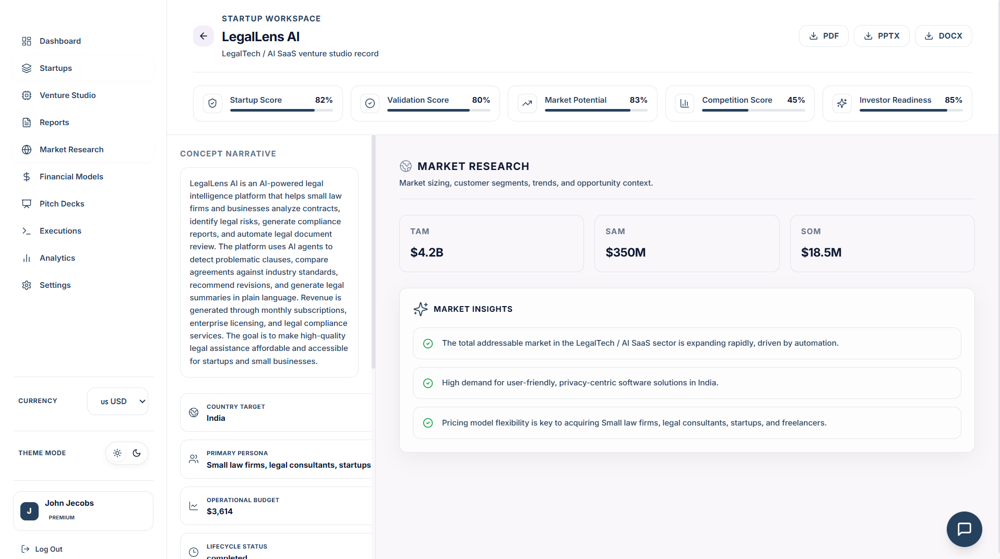

---

### Competitor Analysis Overview
Competitor Analysis provides founders with competitive positioning, SWOT assessment, and product differentiation to reduce market risk.

#### Key Capabilities
- Competitor landscape mapping
- Strengths and weaknesses analysis
- Positioning matrix output
- Feature comparison insights

#### Technical Highlights
- LangGraph agent orchestration
- Structured competitor data modeling
- Responsive comparison tables
- Integrated SWOT generation logic

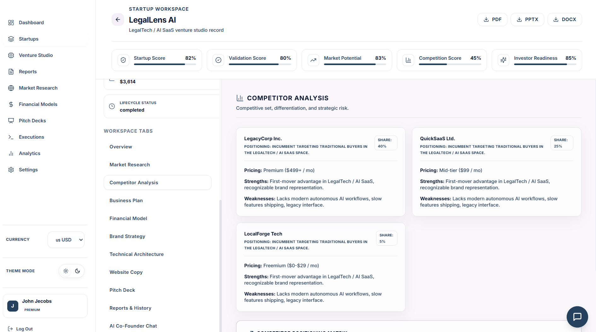

---

### Financial Modeling Overview
The Financial Modeling screen builds runway analysis, revenue forecasts, cost structure, unit economics, and investor-ready financial narratives.

#### Key Capabilities
- 3-year ARR forecast
- Break-even and runway calculation
- Revenue and expense breakdown
- Funding requirement summary

#### Technical Highlights
- Python financial model engine
- Dynamic Pydantic validation
- Report-ready financial tables
- Multi-currency support

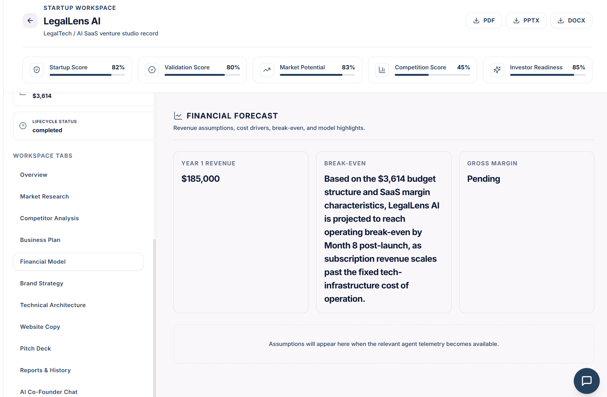

---

### Technical Architecture Overview
The Technical Architecture section delivers a scalable recommended tech stack, system design, and MVP implementation plan tailored to the startup concept.

#### Key Capabilities
- Architecture diagram generation
- Stack recommendation
- Data flow guidance
- MVP milestone plan

#### Technical Highlights
- AI-driven architecture synthesis
- FastAPI + Next.js architecture focus
- Modular deployment patterns
- Backend service and database mapping

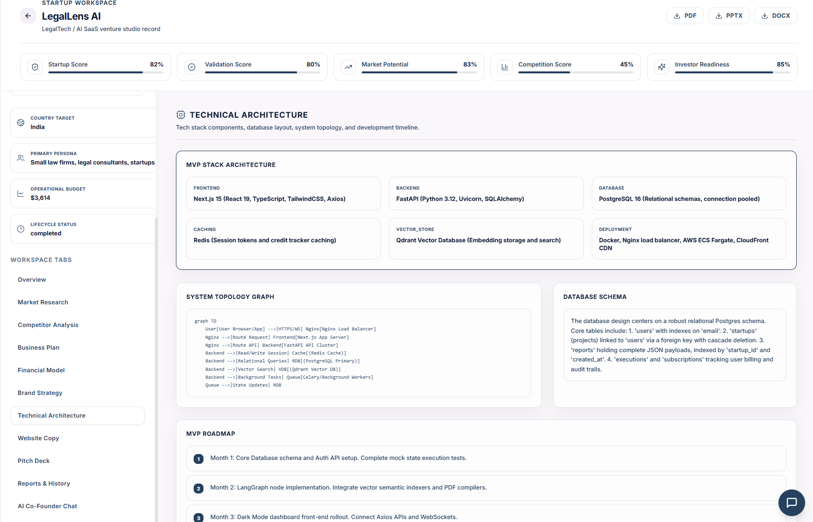

---

### AI Co-Founder Overview
The AI Co-Founder chat interface provides interactive critique, opportunity scoring, and startup improvement suggestions in real time.

#### Key Capabilities
- Idea critique and refinement
- Opportunity and competition scoring
- Pivot recommendations
- Conversational startup coaching

#### Technical Highlights
- Conversational AI interface
- LangChain/LLM prompting
- Session-based state tracking
- Integrated feedback loop

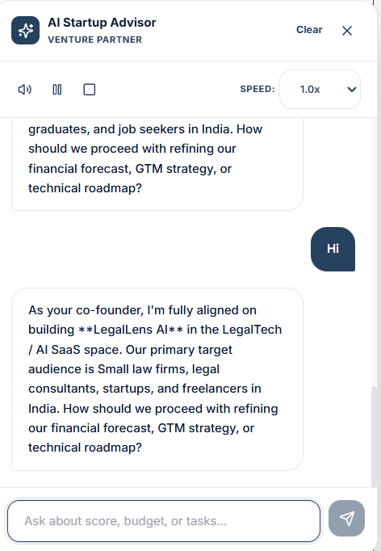

---

### Reports Center Overview
The Reports Center centralizes all generated deliverables, allowing users to preview, download, and track investor-ready outputs across formats.

#### Key Capabilities
- Access to PDF, PPTX, DOCX outputs
- Report generation status
- Export and download controls
- Versioned deliverables archive

#### Technical Highlights
- Document export services in backend
- File storage and retrieval APIs
- Frontend previews and download links
- Structured report metadata model

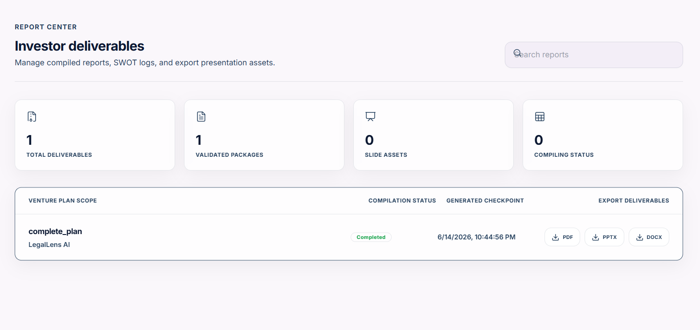

---

## 📑 Sample Generated Reports

StartupForge AI can generate investor-ready deliverables in multiple formats.

### PDF Business Report

Comprehensive startup report including:

- Executive Summary
- Market Research
- Competitor Analysis
- Financial Forecasts
- Growth Strategy

📄 **View PDF Report**

[Open PDF Report](assets/sample-business-report.pdf)

---

### PowerPoint Pitch Deck

Investor-ready presentation including:

- Problem Statement
- Solution
- Market Opportunity
- Revenue Model
- Financial Projections
- Funding Requirements

📊 **View Pitch Deck**

[Open PPTX Deck](assets/sample-reports/sample-pitch-deck.pptx)

---

### Word Business Plan

Detailed startup blueprint including:

- Business Model
- Customer Segments
- Operations Plan
- Go-To-Market Strategy
- Risk Analysis

📝 **View Business Plan**

[Open DOCX Plan](assets/sample-reports/sample-business-plan.docx)

---

## Problem Statement

Startup planning is hard. Founders must balance vision with data, validate assumptions quickly, and deliver polished investor materials before momentum fades.

The hardest gaps for early-stage founders are:

- Market validation without expensive research teams
- Competitor analysis that reveals real positioning risk
- Financial planning that supports runway and investor expectations
- Investor readiness in pitch decks, website copy, and business models

StartupForge AI solves these challenges by turning brief startup concepts into a structured, investor-grade venture blueprint using autonomous AI agents and a repeatable workflow.

---

## Key Features

- ✔ Multi-Agent AI Workflow
- ✔ Startup Validation
- ✔ Market Research
- ✔ Competitor Analysis
- ✔ Financial Modeling
- ✔ Business Plan Generation
- ✔ Brand Strategy
- ✔ Technical Architecture Design
- ✔ Website Copy Generation
- ✔ Investor Pitch Deck Creation
- ✔ AI Co-Founder Assistant
- ✔ Report Export (PDF, DOCX, PPTX)
- ✔ Currency Management
- ✔ Dashboard Analytics

---

## Project Architecture

### High-Level System Architecture

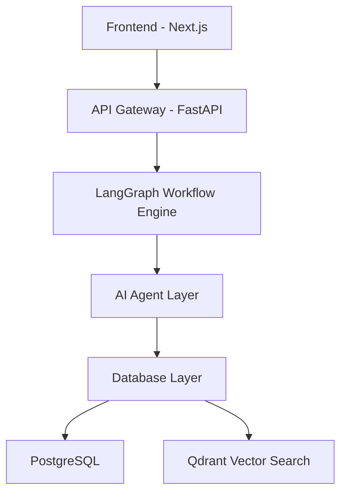

### Architecture Layers

- Frontend: Next.js dashboard, reports center, and startup designer.
- API Gateway: FastAPI routes for authentication, startups, workflows, and exports.
- LangGraph Workflow Engine: orchestrates sequential and parallel agent execution.
- AI Agent Layer: Validator, Research, Competitor, Planner, Finance, Branding, Technical, Website, Investor, Pitch Deck.
- Database Layer: PostgreSQL for structured state and Qdrant for semantic memory.

---

### Multi-Agent Workflow

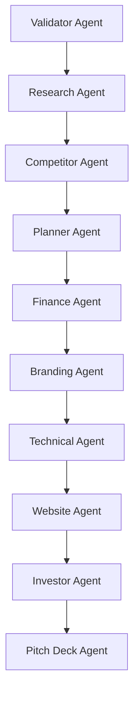

The workflow coordinates specialized AI agents to move a startup concept from validation through investor-ready deliverables.

---

### Source Code Architecture

```text
backend/
├── api/           # HTTP routes and request handlers
├── core/          # Configuration, security, logging, constants
├── agents/        # Agent definitions for startup workflows
├── graph/         # LangGraph orchestration and workflow state
├── services/      # Business logic and AI integration services
├── models/        # ORM entities and domain models
├── schemas/       # Pydantic schemas for API validation
├── repositories/  # Database access and persistence layers
├── database/      # DB initialization, session, migrations
├── tools/         # Utility connectors and integrations
└── utils/         # General-purpose helpers

frontend/
├── app/           # Next.js pages and route handlers
├── components/    # Reusable UI components
├── hooks/         # React hooks for state and data fetching
├── services/      # API client and frontend service wrappers
├── context/       # Authentication and app state providers
├── styles/        # Tailwind and global styling
└── public/        # Static assets, icons, and images
```

---

## Technology Stack

| Layer | Technology |
| --- | --- |
| Frontend | Next.js, TypeScript, TailwindCSS, Framer Motion, Axios |
| Backend | FastAPI, Python, SQLAlchemy, Pydantic |
| AI | LangGraph, LangChain, OpenAI/Ollama, Multi-Agent Architecture |
| Database | PostgreSQL, Qdrant (Vector Database) |
| DevOps | Docker, GitHub, CI/CD |

---

## Installation Guide

### Backend Setup

1. Clone the repository:
   ```bash
   git clone https://github.com/your-org/StartupForge-AI.git
   cd StartupForge-AI/backend
   ```
2. Create a Python virtual environment:
   ```bash
   python -m venv .venv
   .venv\Scripts\activate
   ```
3. Install backend dependencies:
   ```bash
   pip install -r requirements.txt
   ```
4. Create environment variables:
   - `DATABASE_URL`
   - `OPENAI_API_KEY` or `OLLAMA_API_URL`
   - `QDRANT_URL`
   - `SECRET_KEY`
   - `ALLOWED_HOSTS`
5. Run the backend:
   ```bash
   uvicorn app.main:app --reload
   ```

### Frontend Setup

1. Open a new terminal and navigate to frontend:
   ```bash
   cd ../frontend
   npm install
   ```
2. Create a `.env.local` file with:
   - `NEXT_PUBLIC_API_URL`
   - `NEXT_PUBLIC_AUTH_DOMAIN`
3. Run the frontend:
   ```bash
   npm run dev
   ```

### Database Setup

- PostgreSQL: create a database and configure `DATABASE_URL`
- Run migrations from `backend` if applicable

### Qdrant Setup (Optional)

- Install or run Qdrant locally using Docker
- Configure `QDRANT_URL`
- Start vector memory services before launching the application

---

## API Overview

### Authentication
- `POST /api/v1/auth/login`
- `POST /api/v1/auth/register`
- `GET /api/v1/auth/profile`

### Startup Management
- `POST /api/v1/startups`
- `GET /api/v1/startups/{id}`
- `PUT /api/v1/startups/{id}`
- `DELETE /api/v1/startups/{id}`

### Reports
- `GET /api/v1/reports`
- `GET /api/v1/reports/{id}`
- `POST /api/v1/reports/export`

### Workflows
- `POST /api/v1/workflows/execute`
- `GET /api/v1/workflows/history`
- `GET /api/v1/workflows/{id}`

### Dashboard
- `GET /api/v1/dashboard/metrics`
- `GET /api/v1/dashboard/executions`

---

## Engineering Highlights

Demonstrated Skills:

- Full Stack Development
- AI Workflow Orchestration
- LangGraph
- FastAPI
- Next.js
- PostgreSQL
- Authentication
- System Design
- REST API Development
- Database Modeling
- Multi-Agent Architecture

---

## Project Highlights

- ✔ Built a Multi-Agent AI Venture Studio
- ✔ Implemented LangGraph workflow orchestration
- ✔ Developed scalable FastAPI backend
- ✔ Designed responsive Next.js dashboard
- ✔ Created AI-powered startup planning system
- ✔ Integrated semantic memory and vector search
- ✔ Delivered end-to-end investor-ready report generation

---

## Challenges Solved

- State management for multi-agent workflows
- Agent orchestration across research, validation, finance, and pitch generation
- Reliable workflow execution with observable telemetry
- Exporting structured reports and pitch decks automatically
- Secure authentication, data modeling, and API design
- Maintaining startup domain knowledge inside a modular architecture

---

## Future Roadmap

- Voice AI Co-Founder
- Real-time Market Intelligence
- Investor Matching
- Multi-Language Support
- Mobile Application
- Team Collaboration

---

## What This Project Demonstrates

- Full Stack Development
- AI Engineering
- LangGraph Orchestration
- System Design
- Database Design
- API Development
- Authentication
- Product Thinking
- Startup Domain Knowledge

---

## Author

**Animesh Sahoo**

- LinkedIn: `https://linkedin.com/in/animeshsahoo`
- GitHub: `https://github.com/your-org`
- Portfolio: `https://animeshsahoo.dev`

---

## License

This project is licensed under the MIT License.
